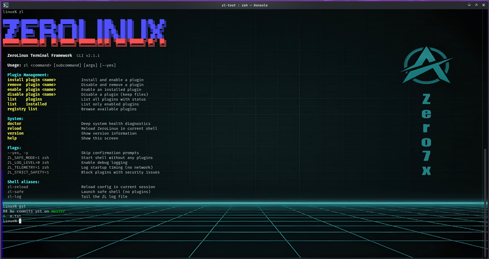

<div align="center">

```
███████╗███████╗██████╗  ██████╗ ██╗     ██╗███╗   ██╗██╗   ██╗██╗  ██╗
╚══███╔╝██╔════╝██╔══██╗██╔═══██╗██║     ██║████╗  ██║██║   ██║╚██╗██╔╝
  ███╔╝ █████╗  ██████╔╝██║   ██║██║     ██║██╔██╗ ██║██║   ██║ ╚███╔╝
 ███╔╝  ██╔══╝  ██╔══██╗██║   ██║██║     ██║██║╚██╗██║██║   ██║ ██╔██╗
███████╗███████╗██║  ██║╚██████╔╝███████╗██║██║ ╚████║╚██████╔╝██╔╝ ██╗
╚══════╝╚══════╝╚═╝  ╚═╝ ╚═════╝ ╚══════╝╚═╝╚═╝  ╚═══╝ ╚═════╝ ╚═╝  ╚═╝
```


# ZeroLinux Terminal

**Your shell in 63ms. Plugins that can't break each other. Full control.**

[](https://github.com/zerolinux-os/zero_terminal/releases)
[](LICENSE)
[](https://www.zsh.org/)
[](https://github.com/zerolinux-os/zero_terminal/actions)

[Install](#-quick-install) · [Plugins](#-plugins) · [CLI](#-cli-reference) · [Docs](docs/README.md) · [Contributing](CONTRIBUTING.md)



</div>

---

## The problem with most Zsh frameworks

Your shell starts in 800ms. A broken plugin silently corrupts another. You run `source ~/.zshrc` and have no idea what loaded.

ZeroLinux fixes all three.

```
$ time zsh -i -c exit

oh-my-zsh:    real 0m0.847s   ← 847ms
zinit:        real 0m0.312s   ← 312ms
ZeroLinux:    real 0m0.063s   ← 63ms  (13× faster than oh-my-zsh)
```

---

## What makes it different

| | oh-my-zsh | antigen | zinit | **ZeroLinux** |
|---|:---:|:---:|:---:|:---:|
| Startup time | 600–900ms | 400–700ms | 200–400ms | **50–80ms** |
| Plugin isolation | ✗ | ✗ | ✗ | **✓ enforced** |
| Security scanner | ✗ | ✗ | ✗ | **✓ 4-pattern** |
| Diagnostics CLI | ✗ | ✗ | ✗ | **`zl doctor`** |
| Dependency resolver | ✗ | partial | partial | **✓ cycle-safe** |
| Safe install/rollback | ✗ | ✗ | ✗ | **✓ always** |
| Single install command | ✓ | ✓ | ✓ | **✓** |

---

## ⚡ Quick install

```bash
git clone https://github.com/zerolinux-os/zero_terminal ~/.zerolinux-src
bash ~/.zerolinux-src/install.sh --yes
exec zsh
```

Verify SHA-256 before installing:

```bash
sha256sum install.sh
# compare with: https://github.com/zerolinux-os/zero_terminal/releases/latest
```

> **Requirements:** zsh ≥ 5.3 · git · curl or wget

---

## What you get immediately

```
$ zl doctor

━━━ ZeroLinux Doctor ━━━━━━━━━━━━━━━━━━━━━━━━━━━━━━

  ✓  zsh 5.9 (≥ 5.3 required)
  ✓  Default shell: /usr/bin/zsh
  ✓  core/loader.zsh
  ✓  core/plugin_manager.zsh
  ✓  Plugin: git    — v2.1.1
  ✓  Plugin: system — v2.1.1
  ✓  No dangerous patterns detected
  ✓  Internet: reachable

  PASS: 24   WARN: 0   FAIL: 0
  ✅  System is healthy
```

```
$ zl list plugins

  NAME               VERSION   STATUS       DESCRIPTION
  ──────────────────────────────────────────────────────────────────
  arch               v2.1.1    ○ disabled   Arch Linux pacman and AUR helper utilities
  docker             v2.1.1    ○ disabled   Docker aliases, interactive container management
  example            v1.0.0    ○ disabled   Reference plugin — copy this to create your own
  git                v2.1.1    ● enabled    Interactive Git tools powered by fzf
  system             v2.1.1    ● enabled    System monitoring: sysinfo, memtop, fkill
```

---

## 🔌 Plugins

Four production-ready plugins ship with the framework. Enable what you need.

### git

Interactive Git tooling powered by fzf.

```bash
gbr          # branch switcher with live log preview
glog         # interactive commit browser
gstash       # fzf stash manager (pop, drop, preview)
groh         # reset to origin/current-branch safely
gst          # git status -sb
gaa          # git add --all
gcm          # git commit -m
gpf          # git push --force-with-lease
gwip         # commit everything as WIP
```

### system

```bash
sysinfo      # full system overview: CPU, RAM, disk, network
memtop       # top N processes by memory
fkill        # fuzzy process kill with multi-select
portopen     # check if host:port is reachable
dus          # disk usage sorted by size
psg          # grep running processes
```

### docker

```bash
dksh         # fzf container picker → exec shell
dkclean      # prune stopped containers, images, volumes, networks
dkip         # print all container IPs
dps / dpsa   # ps / ps -a
dcu / dcd    # compose up -d / compose down
```

### arch *(Arch Linux only)*

```bash
zl_arch_orphans   # list or remove orphaned packages
zl_arch_biggest   # top N packages by installed size
pacfzf            # fzf-powered package search + install
```

---

## 🖥️ CLI Reference

```
zl <command> [subcommand] [args]

Plugin management:
  install plugin <n>    Install and enable a plugin
  remove  plugin <n>    Disable a plugin (keeps files)
  enable  plugin <n>    Enable an installed plugin
  disable plugin <n>    Disable without removing
  list    plugins       All plugins with status
  list    installed     Only enabled plugins
  registry list         Browse available plugins

System:
  doctor                Deep health diagnostics
  reload                Reload ZeroLinux
  version               Version info
  help                  Show help

Flags:
  --yes, -y             Skip confirmation prompts
  --with-ohmyzsh        Also install Oh My Zsh
  ZL_SAFE_MODE=1 zsh    Start without any plugins
  ZL_LOG_LEVEL=0 zsh    Enable debug output
  ZL_STRICT_SAFETY=1    Block unsafe plugins on load
  ZL_DISABLE_AUTOCORRECT=1  Disable zsh spell-correction (default: on)
```

---

## ⚙️ Configuration

Override defaults in `~/.zerolinuxrc`:

```zsh
# ~/.zerolinuxrc

# Log level: 0=DEBUG 1=INFO 2=WARN 3=ERROR  (default: 1)
ZL_LOG_LEVEL=1

# Disable zsh spell-correction — prevents zsh correcting "zl disable" etc.
# 1 = disable (default, recommended)  0 = keep zsh correction
ZL_DISABLE_AUTOCORRECT=1

# Block plugins that fail the security scan  (default: warn only)
ZL_STRICT_SAFETY=0

# Log startup timing to file — no network calls
ZL_TELEMETRY=0
```

### Enable a plugin

```bash
zl enable plugin docker
exec zsh
```

### Write your own plugin

```bash
cp -r ~/.zerolinux/plugins/example ~/.zerolinux/plugins/myplugin
# Edit plugin.zl, init.zsh, commands.zsh
zl install plugin myplugin
```

Plugin structure:

```
plugins/myplugin/
├── plugin.zl        # name, version, description, dependencies
├── init.zsh         # defines plugin_init()
└── commands.zsh     # defines plugin_register_commands()
```

---

## 🔒 Security model

Every plugin is scanned before loading:

| Pattern | What it detects |
|---------|----------------|
| `alias rm=…` | System command override |
| `function sudo()` | System command redefinition |
| `curl … \| sh` | Remote code execution |
| `eval "$var"` | Unsafe eval |

```bash
ZL_STRICT_SAFETY=1 zsh   # block on any finding (default: warn only)
```

`plugin_init()` and `plugin_register_commands()` are `unfunction`'d after each call — no name leaks between plugins.

---

## 🛡️ Safe install and rollback

The installer backs up everything before touching anything:

```
~/.zerolinux_backup/20250410_143022/
├── zshrc.bak
├── zerolinux_home.bak/
└── restore.sh
```

```bash
bash ~/.zerolinux_backup/20250410_143022/restore.sh
```

Your `.zshrc` is never overwritten. ZeroLinux injects a guarded block:

```zsh
# >>> ZEROLINUX START >>>
export ZL_HOME="$HOME/.zerolinux"
source "$HOME/.zerolinux/core/loader.zsh"
# <<< ZEROLINUX END <<<
```

---

## 🗑️ Uninstall

```bash
bash ~/.zerolinux/uninstall.sh
```

Removes the `.zshrc` block, deletes `~/.zerolinux`, removes the `zl` symlink. Complete reversal.

---

## 🤝 Contributing

See [CONTRIBUTING.md](CONTRIBUTING.md).

1. Fork → branch → change → `make test` → PR
2. CI runs automatically on every PR
3. New plugins must pass the security scanner

---

## Acknowledgements

Built with zsh, fzf, and a lot of time spent staring at startup traces. Inspired by the frustrations of oh-my-zsh, the ambitions of zinit, and the simplicity that neither quite reached.

---

<div align="center">

**[⭐ Star this repo](https://github.com/zerolinux-os/zero_terminal)** if ZeroLinux saved you from another slow terminal session.

[🐛 Report a bug](https://github.com/zerolinux-os/zero_terminal/issues/new?template=bug_report.yml) · [💡 Request a feature](https://github.com/zerolinux-os/zero_terminal/issues/new?template=feature_request.yml) · [❤️ Sponsor](https://github.com/sponsors/zerolinux-os)

</div>
